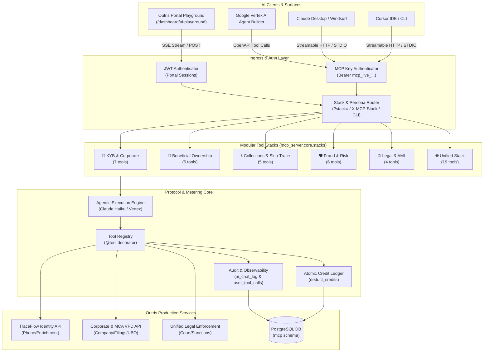

# System Architecture

The Outris Identity Model Context Protocol (MCP) Server is an enterprise intelligence gateway bridging LLMs and AI Agents (Vertex AI Agent Builder, Claude Desktop, Cursor, and Outris AI Playground) to the Outris TraceFlow & KYB backends.

---

## 1. High-Level Architecture

---

## 2. Core Architectural Pillars

### 2.1 Modular Stacks Engine (`mcp_server/core/stacks.py`)
To prevent LLM cognitive overload and stay well within cloud agent schema boundaries, the registry is partitioned into targeted stacks:
- **`kyb`**: Company resolution, MCA VPD filings, UBO tree, GSTIN, PAN, bank verification, court enforcement.
- **`ubo`**: Beneficial ownership unwinding, corporate resolution, filings, GSTIN intelligence, court enforcement.
- **`collections`**: Collections investigation orchestrator, alternate phones, addresses, contacts, full identity profile.
- **`fraud`**: Fraud risk scoring, phone intelligence, social footprint, digital commerce, breach monitoring.
- **`compliance`**: Unified legal enforcement, sanction screening, PAN, bank account verification.
- **`all`**: Complete registry with optional persona-based filtering.

Stack routing is activated via:
- **CLI Flag:** `python -m mcp_server --stdio --stack kyb`
- **Query Parameter:** `POST /http?stack=kyb` or `GET /sse?stack=collections`
- **HTTP Header:** `X-MCP-Stack: ubo`

### 2.2 Client Auditing & Ledger Metering (`mcp_server/core/credits.py` & `chat_routes.py`)
TraceFlow MCP maintains strict multi-tenant accountability:
1. **`mcp.ai_chat_log`**: Logs every AI query turn, user email, model, input/output token counts, tools invoked, credit spend, and latency.
2. **`mcp.user_tool_calls`**: Atomic execution log recording every tool invocation, request UUID, duration, parameters, and outcome.
3. **Credit Ledger**: Deductions are applied via atomic database row-locks (`SELECT ... FOR UPDATE`) to prevent race conditions during parallel tool calls.

### 2.3 OpenAPI Generator for Agent Builders (`scripts/generate_openapi.py`)
Automatically compiles the tool definitions into 7 modular OpenAPI 3.0 specification files for integration into **Google Cloud Vertex AI Agent Builder**, Claude Desktop, or custom OpenAI-compatible agent frameworks.

---

## 3. Transports Supported

| Transport | Protocol | Endpoint / Command | Target Environments |
| :--- | :--- | :--- | :--- |
| **Streamable HTTP** *(Primary)* | Stateless HTTP POST | `POST /http` `GET /tools` | Cloud Run, Docker, Kubernetes, Web Portals |
| **SSE** *(Legacy)* | Server-Sent Events | `GET /sse` | Legacy agent platforms requiring long-lived streams |
| **STDIO** | Standard I/O Pipes | `python -m mcp_server --stdio` | Claude Desktop, Windsurf, Cursor local process |
| **AI Chat Streaming** | Progressive SSE | `POST /api/ai-chat/stream` `POST /api/ai-chat/vertex-agent` | Outris Web Portal AI Playground |

---

## 4. Security & Isolation

1. **Secret Storage**: No credentials or tokens hardcoded in the codebase. Managed via environment variables and GCP Secret Manager.
2. **Multi-Tenant Key Hashing**: MCP keys are hashed with SHA-256 before storage in `mcp.user_accounts`.
3. **Data Boundary**: Tools never communicate directly with internal databases. All operations go through authenticated Outris APIs.
4. **Leak Prevention**: Downstream vendor identities and raw provider schemas are completely abstracted from tool definitions and LLM contexts.
